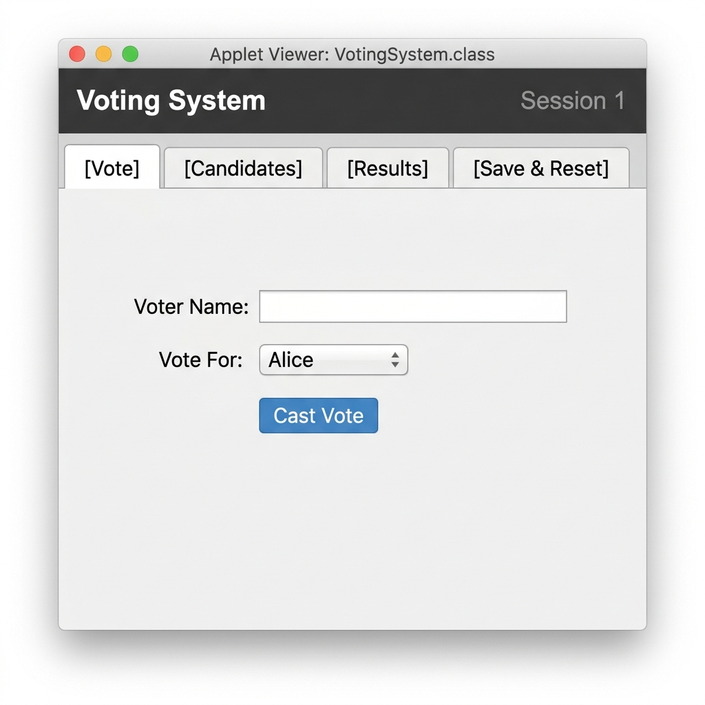

# 🗳️ Java Voting System — Applet-Based Mini Project

<div align="center">


**A beginner-friendly Java Applet that demonstrates four core OOP concepts through an interactive, GUI-based voting system.**

[📋 Features](#-features) • [🧱 Concepts](#-oop-concepts-used) • [📂 Structure](#-project-structure) • [🚀 Getting Started](#-getting-started) • [📖 How It Works](#-how-it-works)

</div>

---

## 🖥️ System Preview

<div align="center">



*The Voting System applet — tab-based GUI with Vote, Candidates, Results, and Save & Reset panels.*

</div>

---

## 📖 About the Project

This mini project was built as a practical exploration of four fundamental Java topics: **Inheritance**, **Polymorphism**, **Multithreading**, and **File Handling**. Rather than demonstrating these concepts in isolation, this project weaves them together into a single cohesive application — a live, interactive voting system with a graphical user interface built entirely using Java AWT and Applet.

The idea is simple: you run a small election session. You add candidates to the ballot, voters step up one by one, type their name, choose who they're voting for, and click **Cast Vote**. Behind the scenes, each vote runs in its own Java `Thread`, the vote counter is updated in a thread-safe way, and results can be saved permanently to a file at any time. When the session ends, a fresh session can be started without losing any history.

This end-to-end flow makes the project genuinely usable — not just a textbook exercise — while keeping the implementation accessible to beginners learning the fundamentals.

---

## ✨ Features

| Feature | Description |
|---|---|
| ➕ **Add Candidates** | Dynamically add any number of candidates before or during a session |
| ➖ **Remove Candidates** | Remove a candidate from the ballot at any time |
| 🗳️ **Cast Votes** | Enter your name, pick a candidate from the dropdown, and click Cast Vote |
| 📊 **View Results** | See a live tally of all votes and the current winner |
| 💾 **Save to File** | Append the session's results to `vote.txt` — never overwrites previous sessions |
| 🔄 **New Session** | Reset the booth for a fresh round; current session is auto-saved first |
| 🏆 **Winner Detection** | Automatically detects the winner, or announces a tie |
| 🗂️ **Tab-Based GUI** | Clean CardLayout UI with 4 tabs: Vote, Candidates, Results, Save & Reset |

---

## 🧱 OOP Concepts Used

This project is deliberately structured so that each Java file maps directly to one or more of the four core concepts. Here is how the pieces fit together.

---

### 1. 🔗 Inheritance — `Voter.java` → `RegularVoter.java`

The foundation is the parent class `Voter`. It defines the three fields every voter has — `name`, `voterId`, and `hasVoted` — along with a default `castVote()` method. The child class `RegularVoter` **extends** `Voter` and reuses all of those fields without re-declaring them.

`RegularVoter` calls `super(name, voterId)` in its constructor to delegate initialization to the parent, which is the classic inheritance pattern.

```java
// RegularVoter.java
public class RegularVoter extends Voter {
    public RegularVoter(String name, String voterId) {
        super(name, voterId);  // calls Voter's constructor — no duplication
    }
    // ...
}
```

> **Key keywords:** `extends`, `super()`

---

### 2. 🔄 Polymorphism — `Voter.java`, `RegularVoter.java`, `VotingBooth.java`

Polymorphism means a single method call behaves differently depending on the actual object at runtime. `VotingBooth.vote()` accepts a `Voter` reference — it doesn't know or care whether the object is a `RegularVoter` or any future voter type. It simply calls `voter.castVote(candidate)`, and Java's dynamic dispatch resolves the correct version at runtime.

`RegularVoter` **overrides** `castVote()` to add the `[Regular]` prefix to the message, giving it its own distinct behavior.

```java
// VotingBooth.java — polymorphism in action
public synchronized String vote(String candidate, Voter voter) {
    String message = voter.castVote(candidate);  // dynamic dispatch
    // ...
}
```

```java
// RegularVoter.java — method override
@Override
public String castVote(String candidate) {
    hasVoted = true;
    return "[Regular] " + name + " voted for " + candidate;
}
```

> **Key keywords:** `@Override`, method overriding, dynamic dispatch

---

### 3. 🧵 Multithreading — `VoterThread.java`, `VotingBooth.java`

Every time a voter clicks **Cast Vote**, the application doesn't process the vote on the main thread. Instead, it creates a `VoterThread` — a class that **extends** Java's built-in `Thread` — and hands the vote off to it. The `run()` method inside `VoterThread` calls `booth.vote()`, which is marked `synchronized` to prevent race conditions when multiple threads update vote counts simultaneously.

```java
// VotingSystem.java — launching the vote in a new thread
VoterThread thread = new VoterThread(voter, candidate, booth);
thread.start();   // triggers run() in a new thread
thread.join();    // wait for it to finish before reading result
```

```java
// VoterThread.java
@Override
public void run() {
    result = booth.vote(candidate, voter);  // runs in its own thread
}
```

The `synchronized` keyword on `VotingBooth.vote()` acts as a lock: only one thread can be inside that method at a time. This ensures that even if two voters submitted simultaneously, no votes would be lost or double-counted.

> **Key keywords:** `extends Thread`, `start()`, `run()`, `join()`, `synchronized`

---

### 4. 📁 File Handling — `VotingBooth.java`

Rather than holding results only in memory (where they vanish when the app closes), the project writes session results to a plain-text file `vote.txt`. The file is opened in **append mode** — meaning each new session's results are added to the *end* of the file, never erasing what came before.

```java
// VotingBooth.java — append mode preserves history
FileWriter fw = new FileWriter(FILE_PATH, true);  // true = append
fw.write("SESSION " + sessionNumber + " - " + timestamp + "\n");
// ... write each candidate's vote count ...
fw.close();
```

A typical `vote.txt` block looks like this:

```
--------------------------------------------------
SESSION 1 - 02-May-2026 11:30 AM
--------------------------------------------------
Alice   : 5 votes
Bob     : 3 votes
Total Votes : 8
Winner      : >>> WINNER: Alice with 5 votes! <<<
--------------------------------------------------
```

> **Key keywords:** `FileWriter`, append mode (`true`), `SimpleDateFormat`

---

## 📊 Concepts Quick-Reference

| Concept | File(s) | Key Technique |
|---|---|---|
| **Inheritance** | `Voter.java` → `RegularVoter.java` | `extends`, `super()` |
| **Polymorphism** | `RegularVoter.java`, `VotingBooth.java` | `@Override`, dynamic dispatch |
| **Multithreading** | `VoterThread.java`, `VotingBooth.java` | `extends Thread`, `start()`, `join()`, `synchronized` |
| **File Handling** | `VotingBooth.java` | `FileWriter`, append mode |

---

## 📂 Project Structure

```
Java-Mini-Project/
│
├── Voter.java              # Base class — defines voter fields & castVote()
├── RegularVoter.java       # Child class — overrides castVote() with [Regular] prefix
├── VoterThread.java        # Thread wrapper — each vote runs in its own thread
├── VotingBooth.java        # Vote counter — synchronized voting + file handling
├── VotingSystem.java       # Main Applet — CardLayout GUI entry point
│
├── VotingSystem.html       # HTML launcher for appletviewer
├── vote.txt                # Generated at runtime — appended each session
├── voting.policy           # Applet security policy (grants file read/write)
├── preview.png             # System preview screenshot
├── .gitignore
├── LICENSE
└── README.md
```

---

## 🚀 Getting Started

### Prerequisites

- Java Development Kit (JDK) **8** (recommended — includes `appletviewer`)
- Terminal / Command Prompt

> **Note for JDK 11+ users:** `appletviewer` was removed in JDK 11. Install JDK 8 alongside your current JDK, or use [IcedTea-Web](https://icedtea.classpath.org/wiki/IcedTea-Web) as a drop-in replacement.

### 1. Clone the Repository

```bash
git clone https://github.com/ankushkhakale/Java-Mini-Project.git
cd Java-Mini-Project
```

### 2. Compile

```bash
javac *.java
```

This produces `.class` files in the same directory.

### 3. Run

```bash
appletviewer VotingSystem.html
```

The Voting System window will open immediately.

---

## 📖 How It Works

1. **Add candidates** — Go to the **Candidates** tab, type a name, and click **Add**. Repeat for as many candidates as needed.
2. **Cast a vote** — On the **Vote** tab, type a voter's name, select a candidate from the dropdown, and click **Cast Vote**. Each vote runs in its own thread.
3. **Check results** — Switch to the **Results** tab to see the live vote tally and the current winner (or a tie message).
4. **Save the session** — Go to **Save & Reset** and click **Save Results to File**. The results are appended to `vote.txt` — previous sessions are never lost.
5. **Start a new session** — Click **Start New Session (Reset)**. The current session is auto-saved first, then all candidates and tallies are cleared for a fresh start.

---

## 🔒 Security Note

Java Applets run in a sandboxed environment. The `voting.policy` file grants the applet permission to read and write files in its own directory. To run with the policy:

```bash
appletviewer -J-Djava.security.policy=voting.policy VotingSystem.html
```

The `vote.txt` path is hardcoded to the project folder so the applet always knows exactly where to write.

---

## 👤 Author

**Ankush Khakale**  
Full-Stack Developer · DevOps Engineer · Agentic AI Practitioner · Oracle ACE Apprentice

- 🌐 Portfolio: [ankushkhakalepage.netlify.app](https://ankushkhakalepage.netlify.app/)
- 🐙 GitHub: [@ankushkhakale](https://github.com/ankushkhakale)
- 🐦 Twitter: [@Stoic_Ankush](https://twitter.com/Stoic_Ankush)

---

## 📄 License

This project is licensed under the **MIT License** — see the [LICENSE](LICENSE) file for details.

---

<div align="center">

*Built with ❤️ as a Java OOP Mini Project — April 2026*

</div>
